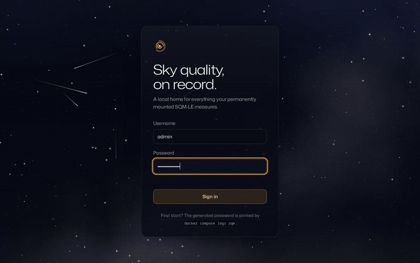
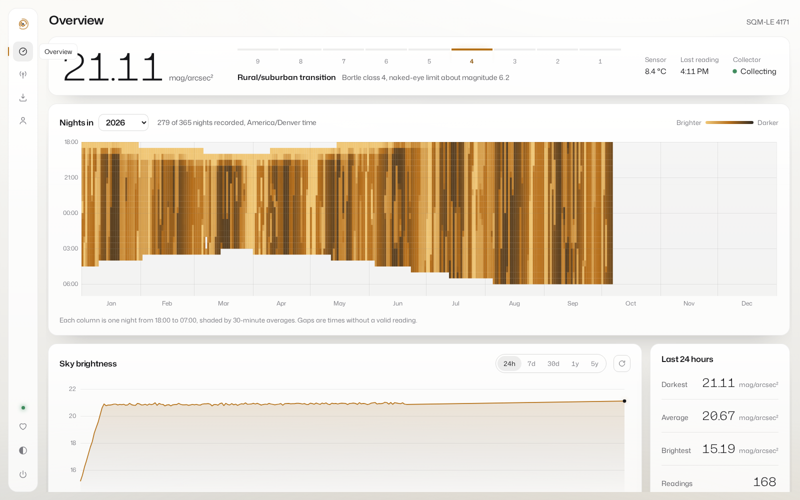
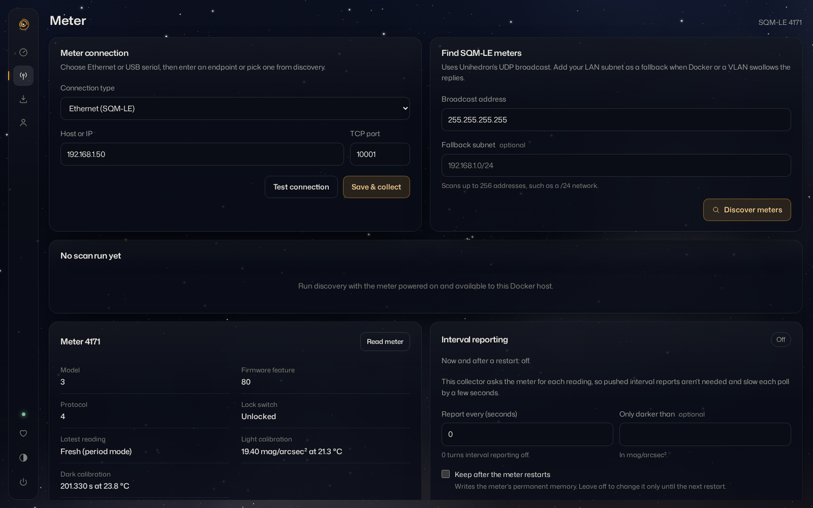
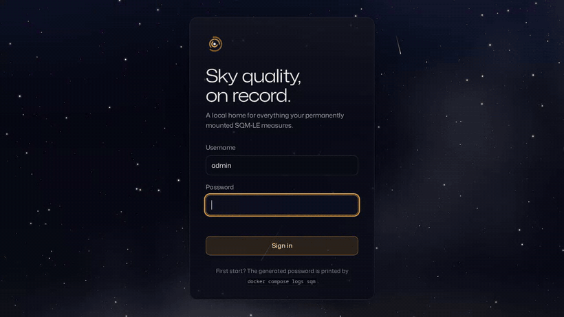
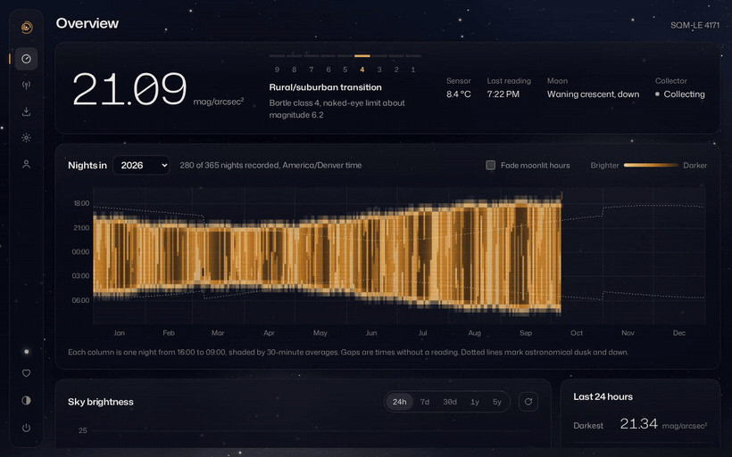
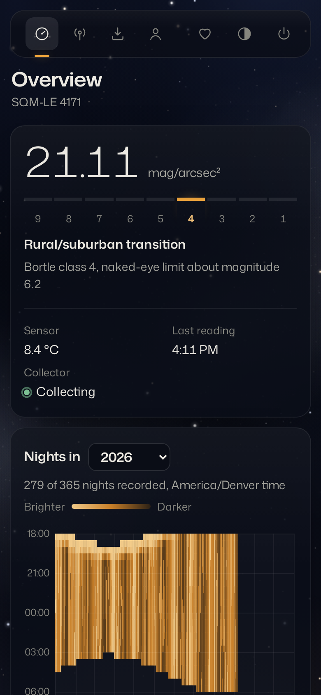

<div align="center">


# Unihedron SQM Collector

A self-hosted dashboard and data logger for Unihedron Sky Quality Meters.

[](https://github.com/YoruDev-Ryland/unihedron-sqm/actions/workflows/container.yml)
[](LICENSE)
[](https://ko-fi.com/rkremeier)

</div>



Unihedron SQM Collector replaces a Windows PC running Unihedron Device Manager
next to a permanently installed sky quality meter. It runs as a single Docker
container, polls an Ethernet or USB meter around the clock, stores every reading
in SQLite, and serves a web dashboard showing tonight's sky, a full year of
nights, and the meter's own settings.

It needs no database server, cloud account, or identity provider, and the image
runs on amd64 and arm64, including a Raspberry Pi in an observatory.

## Features

**Collection**
- Polls SQM-LE meters over Ethernet and SQM-LU, SQM-LU-DL, and SQM-LR meters
  over USB serial, on a schedule you choose.
- Keeps collecting through network drops and meter restarts, retrying on its
  own and reporting the state on the dashboard.
- Copes with meters left in interval-reporting mode: buffered and pushed
  reports are discarded, so every stored reading is fresh.

**Dashboard**
- The current reading in mag/arcsec², with its Bortle class and the naked-eye
  limiting magnitude it implies.
- A year map with one column per night and one cell per half hour, shaded from
  bright to dark, so cloudy spells, moonlit weeks, and seasonal darkness are
  visible at a glance.
- A brightness chart over 24 hours, 7 days, 30 days, 1 year, or 5 years, with
  the darkest, brightest, and average values for the range.

**Meter management**
- Ethernet discovery using Unihedron's UDP protocol, with a subnet scan for
  networks where broadcasts do not reach the container.
- Connection testing before saving, for Ethernet and USB.
- A meter details card: model, firmware feature level, lock switch position,
  reading freshness, and light and dark calibration values.
- Interval reporting control: see what the meter pushes now and after a
  restart, turn it off, or set a period and darkness threshold.

**Data**
- Imports Unihedron Device Manager `.dat` and `.csv` logs by upload or from a
  mounted folder, skipping readings that are already stored.
- A read-only JSON API protected by an API key.

**Interface**
- Dark and light themes. The dark theme sits under a slowly turning star field
  with the occasional meteor, and the meteor rate can be set from Off to
  Shower.
- Works on phones and tablets.

## Screenshots

| Light theme | Meter page |
|---|---|
|  |  |

| Night sky | Theme switch | Phone |
|---|---|---|
|  |  |  |

## Quick start

You need Docker with the Compose plugin. Download the Compose file and the
example settings, then start the container:

```bash
mkdir unihedron-sqm && cd unihedron-sqm
curl -LO https://raw.githubusercontent.com/YoruDev-Ryland/unihedron-sqm/main/compose.yaml
curl -L -o .env https://raw.githubusercontent.com/YoruDev-Ryland/unihedron-sqm/main/.env.example
docker compose up -d
```

Open <http://localhost:7942> (or your server's address on port 7942).

On first start the container creates an `admin` account with a random password
and prints it in the log:

```bash
docker compose logs sqm
```

The same credentials are saved in `/data/initial_admin_credentials.txt` until
you change the password, which the app asks you to do after signing in.

Then open **Meter** and either discover your meter or enter its address.

> [!IMPORTANT]
> An SQM accepts one client at a time. Close Unihedron Device Manager and any
> other software polling the meter before starting the collector.

### A minimal Compose file

If you prefer to write your own, this is all the collector needs:

```yaml
services:
  sqm:
    image: ghcr.io/yorudev-ryland/unihedron-sqm:latest
    container_name: unihedron-sqm
    restart: unless-stopped
    ports:
      - "7942:7942"
    environment:
      TZ: America/Denver        # your local timezone, used for the year map
    volumes:
      - sqm-data:/data

volumes:
  sqm-data:
```

To pin a release instead of following `latest`, use a version tag such as
`ghcr.io/yorudev-ryland/unihedron-sqm:1.0.0`.

### Updating

```bash
docker compose pull
docker compose up -d
```

Your readings and settings live in the `sqm-data` volume and are kept across
updates.

## Connecting a meter

### Ethernet (SQM-LE)

On the **Meter** page, press **Discover meters**. The collector sends
Unihedron's discovery packet (`00 00 00 F6` to UDP port 30718), then confirms
each reply is an SQM by asking it for its unit information over TCP port 10001.

Docker's default bridge network does not pass broadcasts to your LAN, so the
broadcast alone usually finds nothing from inside a container. Enter your LAN
in **Fallback subnet** (for example `192.168.1.0/24`) and the collector also
checks each address on that network directly. You can always type the meter's
address into **Host or IP** and press **Test connection**.

### USB or serial (SQM-LU, SQM-LU-DL, SQM-LR)

USB meters appear on the host as an FTDI serial port and must be mapped into
the container. The included wizard finds the meter and writes the mapping for
you. It needs only Bash:

```bash
curl -LO https://raw.githubusercontent.com/YoruDev-Ryland/unihedron-sqm/main/setup-usb.sh
chmod +x setup-usb.sh
./setup-usb.sh
docker compose up -d
```

The wizard checks the stable `/dev/serial/by-id` names, asks each candidate for
its identity to confirm it is an SQM, shows the model and serial number, and
writes `compose.override.yaml`. Docker Compose loads that file automatically.
It never replaces an override file it did not create; use
`./setup-usb.sh --output compose.usb.yaml` if you already have one.

To map the device yourself, find its stable name and group:

```bash
ls -l /dev/serial/by-id/
stat -c '%g' /dev/serial/by-id/usb-FTDI_YOUR_METER
```

and add it to the service:

```yaml
services:
  sqm:
    devices:
      - /dev/serial/by-id/usb-FTDI_YOUR_METER:/dev/sqm
    group_add:
      - "20"   # the number printed by stat
```

Then choose **USB or serial** on the **Meter** page and press **Find mapped USB
meters**. The container only sees devices you map into it and never needs
privileged mode.

Docker Desktop on Windows and macOS cannot pass USB devices through directly.
Use Docker Desktop's [USB/IP support](https://docs.docker.com/desktop/features/usbip/)
or a Linux host.

## Meter settings

Opening the **Meter** page reads the meter's details over the same connection
the collector uses, pausing collection for a moment so the two never collide.

**Interval reporting** is a meter feature that pushes a reading every few
seconds without being asked. The collector asks the meter for each reading
itself, so pushed reports are not needed and only slow each poll down. The
interval card shows the current setting and the setting the meter will use
after a restart, and lets you change either:

- **Turn off** stops interval reporting.
- **Apply** sets a period in seconds and an optional darkness threshold.
- **Keep after the meter restarts** also writes the change to the meter's
  permanent memory. Leave it unticked to change the setting only until the
  next restart.

Before changing anything, the collector checks the meter's lock switch, and it
reads the settings back afterwards to confirm the meter applied them.

## Importing Device Manager logs

On the **Import** page, drop `.dat` or `.csv` files from Unihedron Device
Manager, or mount a log folder and import it in one step:

```yaml
    volumes:
      - sqm-data:/data
      - /path/to/Unihedron/logs:/imports:ro
```

Timestamps are matched against stored readings, so importing the same files
again adds nothing twice. When a folder holds both `.dat` and `.csv` copies of
a log, the `.dat` file is used.

## JSON API

The API is read-only and uses the key stored in `/data/api_key`:

```bash
docker compose exec sqm cat /data/api_key
```

Send the key in the `X-API-Key` header:

```bash
curl -H "X-API-Key: YOUR_KEY" http://localhost:7942/api/latest
```

```json
{
  "timestamp": "2026-10-07T04:13:51+00:00",
  "mpsas": 21.09,
  "temperature_c": 8.4,
  "frequency_hz": 3,
  "period_counts": 127534,
  "period_seconds": 0.276,
  "bortle": 4,
  "bortle_name": "Rural/suburban transition",
  "nelm": 6.17,
  "raw": "r, 21.09m,0000000003Hz,0000127534c,0000000.276s, 008.4C"
}
```

| Endpoint | Returns |
|---|---|
| `GET /api/latest` | The most recent reading |
| `GET /api/readings?hours=6&order=asc` | Readings for a window; also accepts `since`, `until` (Unix seconds), and `limit` |
| `GET /api/stats?hours=24` | Count, minimum, maximum, and average brightness and temperature |
| `GET /api/device` | The meter's model, serial number, and connection |
| `GET /health` | Collector state, without a key, for container health checks |

Interactive documentation for every endpoint is served at `/docs`. Keys are
only accepted in the header, never in the URL, because URLs end up in logs.
To call the API from a browser on another site, list that site in
`CORS_ORIGINS`.

## Configuration

All settings are optional. Set them in `.env` next to `compose.yaml`.

| Variable | Default | Purpose |
|---|---:|---|
| `TZ` | `UTC` | Local timezone. Readings are stored in UTC; the year map groups them into nights in this zone. |
| `SQM_WEB_PORT` | `7942` | Port on the host for the web interface |
| `PUBLIC_URL` | `http://localhost:7942` | Address shown in the startup log |
| `SQM_TRANSPORT` | `ethernet` | Connection type: `ethernet` or `serial` |
| `SQM_HOST` | blank | Meter hostname or IP |
| `SQM_PORT` | `10001` | Meter TCP port |
| `SQM_SERIAL_DEVICE` | blank | Serial device inside the container, such as `/dev/sqm` |
| `SQM_BAUD_RATE` | `115200` | Serial baud rate |
| `SQM_POLL_INTERVAL` | `60` | Seconds between readings (minimum 5) |
| `SQM_CONNECT_TIMEOUT` | `5` | Seconds to wait for a TCP connection |
| `SQM_READ_TIMEOUT` | `120` | Seconds to wait for a reading; dark skies need long sensor periods |
| `SQM_RETENTION_DAYS` | `0` | Delete readings older than this; `0` keeps everything |
| `ADMIN_USERNAME` | `admin` | Username for the first account |
| `ADMIN_PASSWORD` | generated | Password for the first account, used only on first start |
| `API_KEY` | generated | API key; generated and saved in `/data/api_key` when blank |
| `SESSION_COOKIE_SECURE` | `false` | Set to `true` when the app is served over HTTPS |
| `CORS_ORIGINS` | blank | Comma-separated origins allowed to call the API from a browser |
| `MAX_UPLOAD_MB` | `20` | Largest log file accepted by the importer |

The meter connection can also be chosen on the **Meter** page. A connection
set in the environment takes precedence over one saved in the web interface.
`ADMIN_PASSWORD` and `API_KEY` also accept `_FILE` variants for Docker secrets,
such as `ADMIN_PASSWORD_FILE=/run/secrets/sqm_admin`.

## Running behind a reverse proxy

The container serves plain HTTP on port 7942 and works behind any reverse
proxy. With Traefik, for example:

```yaml
services:
  sqm:
    networks: [proxy]
    labels:
      traefik.enable: "true"
      traefik.http.routers.sqm.rule: Host(`sqm.example.com`)
      traefik.http.routers.sqm.entrypoints: websecure
      traefik.http.routers.sqm.tls: "true"
      traefik.http.services.sqm.loadbalancer.server.port: "7942"
    environment:
      PUBLIC_URL: https://sqm.example.com
      SESSION_COOKIE_SECURE: "true"

networks:
  proxy:
    external: true
```

Remove the `ports:` mapping if the app should only be reachable through the
proxy.

## Backups

Readings, settings, the admin account, and the API key are all stored in the
`/data` volume. Back up the whole volume, ideally with the container stopped so
the SQLite files are consistent:

```bash
docker compose stop
docker run --rm -v unihedron-sqm_sqm-data:/data -v "$PWD":/backup alpine \
  tar czf /backup/sqm-backup.tar.gz -C /data .
docker compose start
```

## Troubleshooting

**The meter sends readings but ignores commands.** On an SQM-LE, Test
connection reports that the meter "isn't answering commands" and the Meter
page shows a warning. The meter's Ethernet module (a Lantronix XPort) is
passing data out but not in. This happens when hardware flow control is on but
no configurable pin is set to receive the meter's ready signal. Open the
meter's address in a browser (by default the XPort configuration login has a
blank username and password), then either:

- set a configurable pin to **HW Flow Control In** (on XPort firmware 6.x only
  CP3 offers it), or
- set **Channel 1, Serial Settings, Flow Control** to **None**.

Press **OK**, then **Apply Settings**. Unihedron Device Manager's **XPort
defaults** button restores the factory settings in one step.

**Discovery finds nothing.** Fill in **Fallback subnet**. Broadcasts rarely
leave a Docker bridge network, and some host firewalls drop the replies.

**I forgot the admin password.** Remove the account and let the container
create a new one with a fresh password:

```bash
docker compose stop
docker compose run --rm sqm python -c "import sqlite3; db = sqlite3.connect('/data/sqm.db'); db.execute('DELETE FROM users'); db.commit()"
docker compose up -d
docker compose logs sqm
```

Your readings and settings are not affected.

## How it works

The collector is a Python application built on FastAPI. One background task
polls the meter with Unihedron's documented `rx` command over TCP port 10001
or the serial port, and writes each reading to SQLite in WAL mode. Before
every command it discards anything the meter's Ethernet module buffered while
no client was connected, and it skips pushed interval reports while waiting
for its reply, so stale data is never stored as a new reading.

The web interface is plain HTML, CSS, and JavaScript served by the same
container, with no build step. Charts are drawn on canvas. The year map is
built from 30-minute averages that SQLite groups in a single query, which are
then assigned to local nights in the configured timezone.

The Meter page shares the collector's connection lock and sends all of its
commands over one connection, because the XPort refuses a new connection made
immediately after the previous one closes.

## Development

```bash
python -m venv .venv
. .venv/bin/activate
pip install -r requirements-dev.txt
pytest
uvicorn sqm_service.main:app --reload --port 7942
```

To build and run the container from your checkout instead of pulling the
published image:

```bash
docker compose -f compose.yaml -f compose.dev.yaml up -d --build
```

The tests cover the meter protocol (with simulated Ethernet and serial
meters), meter settings, the importer, the year map, sky-quality conversions,
the meter web routes, and security helpers. The `tests/smoke_*.py` scripts are
end-to-end checks to run against a started container.

Every push to `main` and every version tag runs the tests and publishes a
multi-architecture image to the GitHub Container Registry.

## Support

If this project is useful at your observatory, you can support its development
on [Ko-fi](https://ko-fi.com/rkremeier).

## License

Unihedron SQM Collector is free software under the
[GNU General Public License v3.0](LICENSE). It is an independent project and is
not affiliated with Unihedron.

The interface uses [Mona Sans](https://github.com/github/mona-sans), bundled
under the SIL Open Font License (`sqm_service/static/fonts/OFL.txt`).
